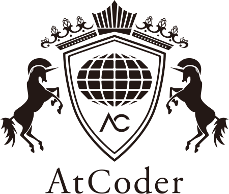

# Hi 👋, I'm ryota2357

- 🔭 I’m a student at **The University of Electro-Communications**
- 🌱 I’m currently learning **Neovim, Rust, Computer Science, etc**
- 👨‍💻 All of my projects are available at [https://ryota2357.com/works](https://ryota2357.com/works)
- 📝 I regularly write articles on [https://ryota2357.com/blog](https://ryota2357.com/blog)

## Status

 

 
 

## Connect with me

